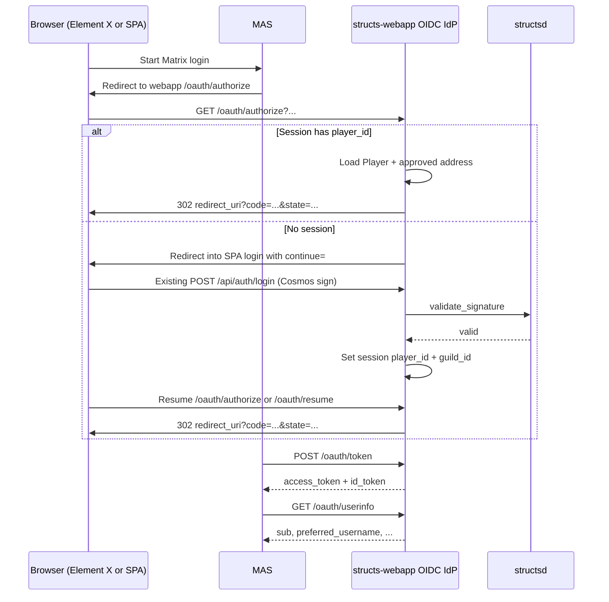

# Structs Webapp — OIDC Identity Provider Spec (for Matrix Auth)

**Audience:** `structs-webapp` team  
**Purpose:** Implement the OIDC provider APIs and minimal SPA/client pieces so Matrix Authentication Service (MAS) can use the guild webapp as its upstream identity provider.  
**Related docs:** [PLANNING.md](./PLANNING.md), [USAGE.md](./USAGE.md)  
**Codebase reviewed against:** [playstructs/structs-webapp](https://github.com/playstructs/structs-webapp) (Symfony 7.4 / PHP ≥8.3), plus [structsd](https://github.com/playstructs/structsd) signature validation and [docker-structs-guild](https://github.com/playstructs/docker-structs-guild) deploy wiring. Local clones: [`.references/`](./.references/README.md).

This document is implementation-focused. It does **not** ask the webapp team to run Synapse/MAS or build an in-game chat UI. It asks for:

1. A standards-compatible OIDC provider on the webapp
2. Authorization gated by the **existing** Cosmos signature session
3. Minimal SPA support so authorize can resume after wallet login

---

## 1. Why this exists

Guilds will optionally run Matrix chat (Synapse + MAS). Players must authenticate with their **Structs / Cosmos address**, the same way they already authenticate to the webapp.

Today (already shipped):

```text
SPA signs LOGIN_GUILD… message
  → POST /api/auth/login
  → SignatureValidationManager → structsd:1317/structs/validate_signature/...
  → PHP session: player_id + guild_id
  → PlayerAuthenticator gates later /api/* calls
```

Needed for Matrix:

```text
Existing webapp session
  → webapp OIDC authorize + tokens
  → MAS (upstream OIDC client)
  → Matrix access token
  → Synapse
```

Cosmos signatures remain the only credential. OIDC is only the bridge into Matrix. MAS never sees the private key or signature.

---

## 2. Scope

### In scope (webapp team)

| Area | Deliverable |
|---|---|
| OIDC discovery | `/.well-known/openid-configuration` |
| Authorization | `/oauth/authorize` (path flexible; must be advertised) |
| Token | `/oauth/token` |
| JWKS | `/oauth/jwks` |
| UserInfo | `/oauth/userinfo` |
| Auth gate | Reuse existing wallet session (`player_id` in session) |
| Silent SSO | Session present → issue code without re-signing |
| Interactive login | No session → SPA wallet login → resume authorize |
| Client registry | Configured confidential client for MAS |
| Claims | Stable `sub` = **player.id**; username/pfp/address as profile claims |
| SPA continue hook | After successful login, return to pending OIDC authorize |
| Tests | Acceptance checklist below |

### Out of scope

- Deploying Synapse / MAS (infra / `docker-structs-guild`)
- Matrix rooms, Spaces, moderation
- Full chat panel / `matrix-js-sdk` product UI
- Guild-rank → Matrix power-level sync
- Changing `structsd` signature verification

---

## 3. Map to the existing webapp (important)

Paths below are relative to `structs-webapp` (app root is `src/`).

### Existing auth surface (reuse)

| Piece | Location |
|---|---|
| HTTP routes | `src/src/Controller/AuthController.php` — `POST /api/auth/login`, `POST /api/auth/signup`, `GET /api/auth/logout` |
| Login logic | `src/src/Manager/AuthManager.php::login` |
| Signature verify | `src/src/Manager/SignatureValidationManager.php` |
| Session authenticator | `src/src/Security/PlayerAuthenticator.php` |
| Firewalls | `src/config/packages/security.yaml` |
| SPA auth orchestration | `src/js/managers/AuthManager.js` |
| HTTP + 401 recovery | `src/js/api/GuildAPI.js` |
| Wallet signing | `src/js/managers/WalletManager.js` |
| Login DTO | `src/js/dtos/LoginRequestDTO.js` |
| Client auth “routes” | `src/js/controllers/AuthController.js` (SPA, not Symfony) |

### Login API (unchanged)

`POST /api/auth/login` — JSON body:

```json
{
  "address": "structs1...",
  "signature": "<hex secp256k1 signature>",
  "pubkey": "<hex compressed pubkey>",
  "guild_id": "0-1",
  "unix_timestamp": "1738005969"
}
```

Success `200`: `{ "success": true, "errors": [], "data": null }`  
Failure `401`: `{ "success": false, "errors": { "signature_validation_failed": "Invalid signature" }, ... }`

Login message format (must stay in sync with `structsd` verification):

```text
LOGIN_GUILD{$guildId}ADDRESS{$address}DATETIME{$timestamp}
```

Expiry: **600 seconds** (`SignatureValidationManager::MSG_EXPIRY_TIME`). Timestamp from `GET /api/timestamp`.

Verify call (server-side today):

```text
GET http://structsd:1317/structs/validate_signature/{address}/{pubkey}/{signature}/{message}
```

Response includes `valid: true|false` (see `structsd` `Query/ValidateSignature`).

### Session model (OIDC authorize reads this)

On successful login, `AuthManager::login` does:

```php
$security->login($player, PlayerAuthenticator::class, 'api', [...]);
$session->set('player_id', $player->getId());
$session->set('guild_id', $parsedRequest->params->guild_id);
```

`PlayerAuthenticator` only runs for URIs under `/api/` and requires `session.player_id`. Unauthenticated API calls return **JSON 401** (`errors.authentication_error = "Login required"`), not an HTML login redirect.

### Guild for this deploy

Not an env var. Resolved from DB:

```sql
-- GuildManager::getThisGuild() / GET /api/guild/this
WHERE guild_meta.this_infrastructure = TRUE
LIMIT 1
```

SPA stores that as `gameState.thisGuild` and sends its `id` on every login. OIDC should only issue tokens for players whose address is **approved** for this guild (`player_address.status = 'approved'`).

### Profile claims sources

Doctrine `App\Entity\Player` does **not** map `username` / `pfp`. Those live on the `player` table and are loaded via SQL in `PlayerManager::getPlayer` (and exist on `PlayerPending` during signup).

For OIDC claims (as shipped by the webapp team):

| Claim | Source | Rules |
|---|---|---|
| `sub` | `Player.id` / `structs.player.id` (e.g. `1-42`) | **Immutable.** MAS turns this into the Matrix localpart. Never change meaning. |
| `preferred_username` | SQL `player.username` | May change; display only |
| `name` | same as preferred_username when set | optional |
| `picture` | SQL `player.pfp` | optional |
| `guild_id` | `player.guild_id` | must match the OIDC client's registered guild |
| `primary_address` | `player.primary_address` | **Descriptive only** — not used as `sub` |

**Do not use wallet address as `sub`.** Addresses can rotate on chain and would orphan Matrix history. Publish the address as `primary_address` instead.

### Stack versions (composer, not README)

- PHP `>=8.3`
- Symfony `7.4.*` (`framework-bundle`, `security-bundle`)
- No application OAuth/OIDC code today (vendor has unused OIDC helpers; nothing configured)

README still mentions Symfony 6.3 / PHP 8.2 — ignore that for planning.

---

## 4. Architecture



---

## 5. Symfony firewall / routing gotcha (read this)

**Do not put `/oauth/authorize` under the `api` firewall as-is.**

Today (`security.yaml`):

| Pattern | Behavior |
|---|---|
| `^/api/auth/` | `security: false` (public) |
| `^/api/` | `security: true` + `PlayerAuthenticator` → JSON 401 if no session |

Browser OIDC authorize must:

- Accept unauthenticated visitors (redirect to SPA login)
- Accept authenticated visitors (issue code)
- Return **HTTP redirects / HTML**, not JSON 401

**Recommended approach:**

1. Add a dedicated public firewall, e.g. `^/oauth/` with `security: false` (or optional session), **before** the `api` firewall.
2. In the authorize controller, read `$request->getSession()->get('player_id')` directly (same pattern as optional session under `/api/auth/*`).
3. Keep `/oauth/token` server-to-server (client secret); no browser session required there.

Putting authorize under `/api/auth/oauth/authorize` also works (public), but keep paths clean and advertise them in discovery.

---

## 6. Recommended libraries

Prefer a maintained OAuth2/OIDC server rather than hand-rolling JWT/auth codes.

Suggested for this Symfony 7.4 app:

- `league/oauth2-server` (or a maintained Symfony bridge)
- OIDC: ID token + discovery + JWKS on authorization-code grants
- Persist clients / auth codes in Postgres (`structs` DB already used by webapp via `structs_webapp` role)

Hand-roll only: session gate, SPA resume, claims mapping from `Player` / SQL profile.

---

## 7. Issuer and base URLs

Each guild webapp has a public HTTPS origin (issuer), e.g.:

```text
https://guild.example.structs.game
```

Discovery and all endpoint URLs must use that exact `issuer` string. MAS config will set:

```yaml
issuer: "https://guild.example.structs.game"
client_id: "matrix-auth-service"
client_secret: "<shared secret>"
scope: "openid profile"
```

`docker-structs-guild` currently exposes webapp on `${DIRECT_WEBAPP_HTTP_PORT}:80` / HTTPS `443` with no domain vars yet — issuer URL will be guild-specific in real deploys.

---

## 8. Required endpoints

### 8.1 `GET /.well-known/openid-configuration`

Public. Example:

```json
{
  "issuer": "https://guild.example.structs.game",
  "authorization_endpoint": "https://guild.example.structs.game/oauth/authorize",
  "token_endpoint": "https://guild.example.structs.game/oauth/token",
  "jwks_uri": "https://guild.example.structs.game/oauth/jwks",
  "userinfo_endpoint": "https://guild.example.structs.game/oauth/userinfo",
  "response_types_supported": ["code"],
  "subject_types_supported": ["public"],
  "id_token_signing_alg_values_supported": ["RS256"],
  "scopes_supported": ["openid", "profile"],
  "token_endpoint_auth_methods_supported": ["client_secret_post", "client_secret_basic"],
  "grant_types_supported": ["authorization_code"],
  "code_challenge_methods_supported": ["S256"]
}
```

Requirements:

- Authorization code only (no implicit)
- **PKCE S256** supported
- Refresh tokens optional for v1

### 8.2 `GET /oauth/jwks`

Public JWKS for ID token verification (RS256 recommended). Support key rotation by leaving old `kid`s published until tokens expire.

### 8.3 `GET /oauth/authorize`

Standard query params: `response_type=code`, `client_id`, `redirect_uri`, `scope`, `state`, `nonce`, `code_challenge`, `code_challenge_method=S256`.

**Behavior:**

1. Validate client, exact `redirect_uri`, `response_type`, scopes.
2. If `session.player_id` is set:
   - Load `Player`; confirm still valid for this guild.
   - Prefer ensure `primary_address` (or login address) has `player_address.status = 'approved'` for session `guild_id`.
   - Create one-time auth code bound to user, client, redirect_uri, scopes, PKCE challenge, nonce.
   - `302` to `redirect_uri?code=...&state=...`.
3. If no session:
   - Persist the authorize request (session key or short-lived server record), e.g. `oidc_authorize_request`.
   - Redirect browser into the **SPA** login entry (there is no server-rendered login page).

Suggested continue URL pattern:

```text
/#/Auth/loginActivateDevice?continue=/oauth/resume
```

or store continue only server-side and use:

```text
/#/Auth/index   (then SPA always calls /oauth/resume after login if cookie flag set)
```

Exact SPA route names today (`src/js/controllers/AuthController.js`): `index`, `loginActivateDevice`, `loggingIn`, recovery/signup flows. Wire into whichever path “Returning Player” already uses.

4. `/oauth/resume` (or re-hit authorize): if session now present, complete step 2.

**Do not** issue codes for non-approved addresses / missing players.

### 8.4 `POST /oauth/token`

Client-authenticated (MAS). `grant_type=authorization_code` + `code` + `redirect_uri` + `code_verifier` + client credentials.

Success:

```json
{
  "access_token": "...",
  "token_type": "Bearer",
  "expires_in": 3600,
  "id_token": "...",
  "scope": "openid profile"
}
```

Auth codes: single-use, short TTL (≤ ~2 minutes).

### 8.5 `GET /oauth/userinfo`

Bearer access token → JSON claims (§9).

---

## 9. Claims contract (critical)

MAS maps claims to Matrix identity. Wrong `sub` = broken / colliding Matrix accounts.

### Required

| Claim | Value |
|---|---|
| `sub` | Chain player id (`structs.player.id`, e.g. `1-42`) |
| `iss` | Exact discovery issuer URL |

### Recommended / profile scope

| Claim | Value |
|---|---|
| `preferred_username` | `player.username` |
| `name` | same as preferred_username if useful |
| `picture` | `player.pfp` URL if set |
| `guild_id` | `player.guild_id` |
| `primary_address` | Cosmos address (never identifying for Matrix) |

### Example `id_token` payload

```json
{
  "iss": "https://guild.example.structs.game",
  "sub": "1-42",
  "aud": "matrix-auth-service",
  "exp": 1770000000,
  "iat": 1769996400,
  "nonce": "…",
  "preferred_username": "CoolPilot",
  "picture": "https://...",
  "guild_id": "0-7",
  "primary_address": "structs1abcxyz..."
}
```

Infra configures MAS roughly as:

```yaml
claims_imports:
  localpart:
    action: require
    template: "{{ user.sub }}"
  displayname:
    action: suggest
    template: "{{ user.preferred_username }}"
```

Matrix user ID becomes:

```text
@1-42:guild.example.structs.game
```

`sub` rules:

- Immutable player id string from chain/DB
- Safe Matrix localpart characters (digits, hyphen in Structs ids)
- Never put signatures, pubkeys, or mnemonics in tokens
- Do not key Matrix identity on wallet address

---

## 10. OAuth client registration (MAS)

v1 needs one confidential client (env-driven):

| Field | Example |
|---|---|
| `client_id` | `matrix-auth-service` |
| `client_secret` | `OIDC_MAS_CLIENT_SECRET` |
| `redirect_uris` | Exact MAS upstream callback URL (from infra) |
| `grant_types` | `authorization_code` |
| `scopes` | `openid`, `profile` |

```bash
OIDC_ISSUER=https://guild.example.structs.game
OIDC_MAS_CLIENT_ID=matrix-auth-service
OIDC_MAS_CLIENT_SECRET=...
OIDC_MAS_REDIRECT_URI=https://auth.guild.example.structs.game/upstream/callback/...
OIDC_JWT_PRIVATE_KEY_PATH=/run/secrets/oidc_jwt.pem
OIDC_JWT_KEY_ID=2026-01-key-1
```

Redirect URI matching must be exact (scheme, host, path, trailing slash).

---

## 11. SPA / frontend work (minimal)

There is **no** Symfony Twig login page. Login is the SPA (`GameController` serves `/`, JS handles Auth routes).

### Required frontend pieces

1. **After successful `GuildAPI.login` / `AuthManager.login`:** if an OIDC continue is pending, navigate to `/oauth/resume` (full page load is fine and helps cookies).
2. **Optional:** tiny “Continue to Matrix as {username}” page before issuing the code (can skip for v1 first-party MAS).
3. **Error UX:** invalid client, redirect mismatch, not approved for guild.

Hook location: `src/js/managers/AuthManager.js` after successful login (and any path that already calls `recoverSession` / device activation login).

Sketch:

```javascript
// after successful POST /api/auth/login
const continueUrl = sessionStorage.getItem('oidc_continue') || '/oauth/resume';
sessionStorage.removeItem('oidc_continue');
if (window.location.pathname.startsWith('/oauth') || sessionStorage.getItem('oidc_pending')) {
  window.location.assign(continueUrl);
  return;
}
// else existing post-login game boot...
```

Backend should also set a server-side pending authorize record so resume works even if `sessionStorage` was cleared, as long as the PHP session cookie exists.

### Cookie notes (current defaults)

From Framework defaults (not overridden in app config):

- `cookie_samesite`: **lax**
- `cookie_secure`: **auto**
- `cookie_httponly`: **true**

Top-level OIDC redirects on the same site work with Lax. Do **not** switch to `SameSite=Strict` without retesting authorize resume. Cross-subdomain designs may need explicit `cookie_domain` later.

API login has **no CSRF token** today (JSON). OIDC should use OAuth `state` / `nonce` / PKCE — not Symfony form CSRF on authorize GET.

`JsonAjaxer` uses same-origin `fetch` (cookies included for `/api`). Authorize is a top-level navigation, not `fetch`.

---

## 12. Security requirements

- HTTPS in production
- Confidential MAS client + secret
- Single-use short-lived auth codes
- Bind code to client_id, redirect_uri, user, PKCE, nonce
- Exact redirect URI match
- RS256 (or ES256) ID tokens with `iss`, `sub`, `aud`, `exp`, `iat` (+ `nonce` when provided)
- **`iat` / `exp` must be integer seconds** (no fractional NumericDate). `lcobucci/jwt` will emit floats from `DateTimeImmutable` microseconds; MAS (`openidconnect-rs`) rejects them with `invalid claim "exp"`. Truncate to whole seconds before signing.
- Only approved guild members
- Rate-limit authorize similarly to login abuse controls
- Never put wallet secrets in tokens or logs

Establishing a session still depends on `structsd`. Completing authorize from an **existing** session does not need another signature.

---

## 13. Acceptance tests

### A. Discovery & keys

- [ ] Discovery JSON serves; `issuer` matches configured value
- [ ] JWKS verifies a freshly issued `id_token`

### B. Silent path (already logged into webapp)

- [ ] Complete SPA wallet login (`POST /api/auth/login`)
- [ ] `GET /oauth/authorize` with valid MAS client params
- [ ] Redirect to registered `redirect_uri` with `code` + `state`
- [ ] Token exchange with client secret + PKCE succeeds
- [ ] `id_token.sub` equals `Player.id` (e.g. `1-42`)
- [ ] `preferred_username` matches webapp username when set
- [ ] `/oauth/userinfo` returns the same `sub`
- [ ] `primary_address` claim present when profile scope requested (descriptive)

### C. Interactive path (cold browser)

- [ ] Clear cookies; hit authorize
- [ ] Land in SPA login; complete Cosmos sign-in
- [ ] Resume authorize; receive `code` (request not lost)

### D. Negatives

- [ ] Bad `client_id` / `redirect_uri` → error (never open redirect)
- [ ] Reused code → rejected
- [ ] Bad PKCE verifier → rejected
- [ ] Session for non-approved address / wrong guild → denied
- [ ] Putting authorize under secured `/api/` without special-case → confirm you did **not** leave JSON 401 as the unauthenticated UX

### E. Interop (with infra)

- [ ] MAS upstream login completes against this issuer
- [ ] Matrix localpart equals Cosmos `sub`

Use an OIDC debugger for A–D before involving MAS.

---

## 14. Suggested implementation plan

1. Add OAuth2/OIDC server dependency + DB tables (clients, auth codes).
2. Add `/oauth` (or `/api/auth/oauth`) **public** firewall entry in `security.yaml`.
3. Implement discovery, JWKS, authorize, token, userinfo.
4. Claims loader: `sub = player.id`; profile claims for username/pfp/address/guild.
5. SPA: pending-continue after `AuthManager.login` / device login success.
6. Env-based MAS client registration.
7. Pass acceptance tests A–D; hand issuer + client secret + redirect URI to Matrix/infra.

Rough effort for someone who already knows this auth stack: **several days to ~1–2 weeks**, mostly OIDC packaging + cookie/resume edge cases — not a multi-month rewrite.

---

## 15. What to return to Matrix / infra

```text
Issuer:              https://<guild-webapp-host>
Discovery:           https://<guild-webapp-host>/.well-known/openid-configuration
Client ID:           matrix-auth-service
Client secret:       <secret store>
Confirmed callback:  <exact MAS redirect URI>
Claims:
  sub                = player.id
  preferred_username = player.username
  primary_address    = player.primary_address (descriptive)
Staging test:        approved address + how to complete SPA login
Firewall note:       /oauth/* is public; session optional on authorize
```

Matrix homeserver bring-up (Synapse + MAS) lives in this repo — see [README.md](./README.md) and [docs/SETUP.md](./docs/SETUP.md). Webapp only needs the IdP contract above.

---

## 16. Reference links

- [OpenID Connect Core](https://openid.net/specs/openid-connect-core-1_0.html)
- [PKCE (RFC 7636)](https://datatracker.ietf.org/doc/html/rfc7636)
- [Matrix Authentication Service](https://element-hq.github.io/matrix-authentication-service/)
- Webapp auth: `AuthController.php`, `AuthManager.php`, `SignatureValidationManager.php`, `PlayerAuthenticator.php`, `security.yaml`
- SPA auth: `src/js/managers/AuthManager.js`, `src/js/api/GuildAPI.js`
- Chain verify: `GET /structs/validate_signature/{address}/{proofPubKey}/{proofSignature}/{message}` ([structsd](https://github.com/playstructs/structsd))
- Broader plan: [PLANNING.md](./PLANNING.md)

---

## 17. One-paragraph summary

Keep Cosmos wallet login as-is. Add a small OIDC provider on the webapp. When MAS redirects to `/oauth/authorize`, either silently continue from the existing PHP session (`player_id`) or send the user through the SPA signature login and resume. At `/oauth/token`, return an ID token whose `sub` is `player.id`. Watch the firewall: authorize must not be a JSON-401 `/api/` route. That is the full webapp contract for Matrix chat identity.
